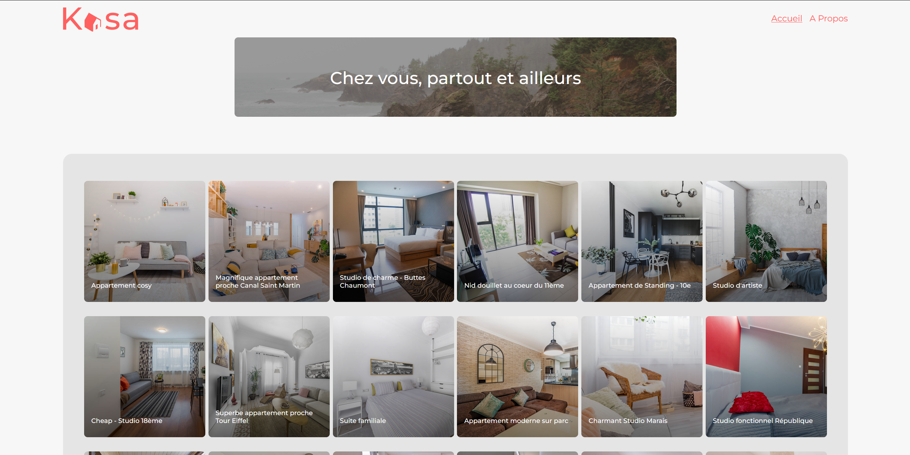

#KASA
___

This App was built in a training context of OpenClassRooms school. 

The technologies I used are React JS and Sass.

## How to start the project
* Clone the repo or download the zip file 
* Install project dependencies : `npm install`
* Run React `npm start`
* You should be able to see the app in your broweser http://localhost:3000/
  ___

## Hosted version
You can see the render of this project on https://kasa-two.vercel.app/

## More about me
Find more of my project on my portfolio  https://julien-chanon.fr/